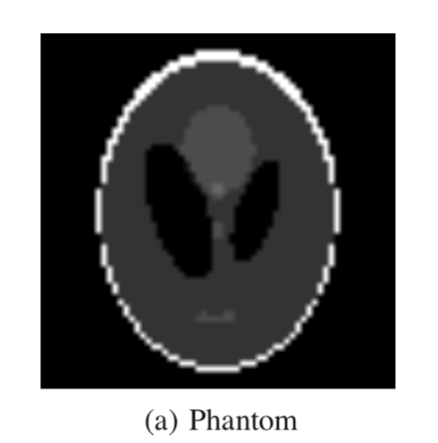
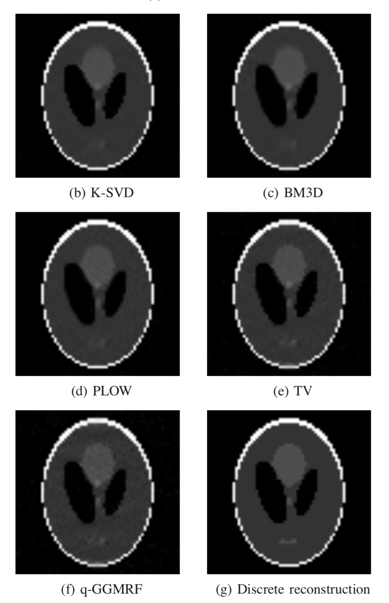
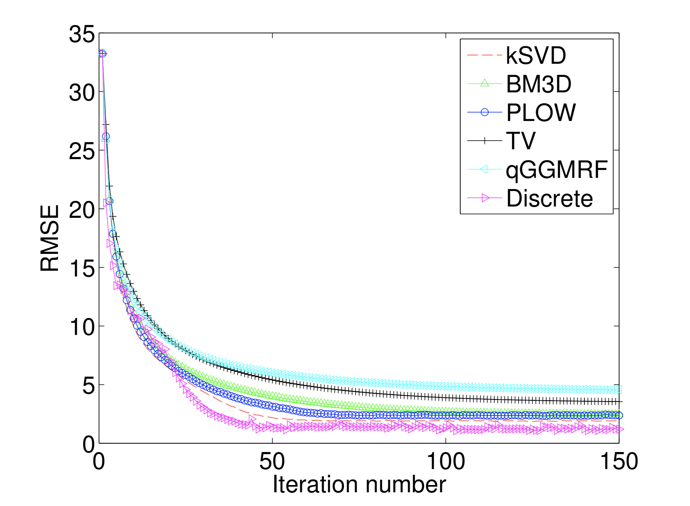
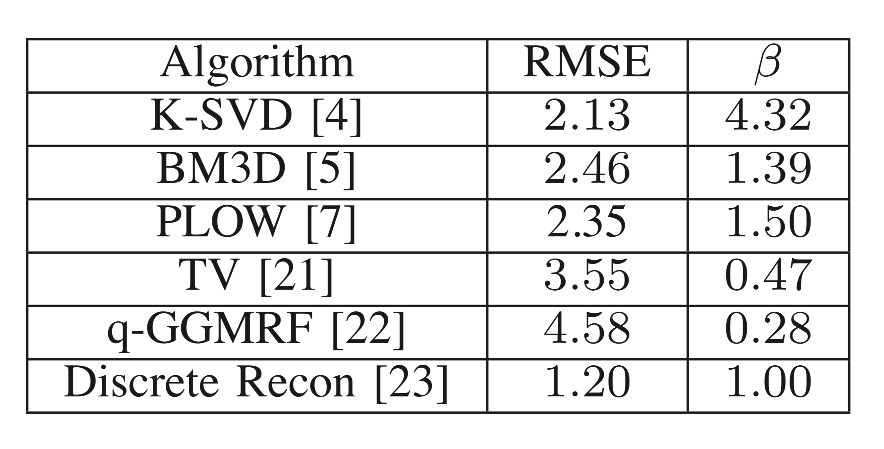

## Motivation

- In class, we had an image reconstruction problem: 

$y$: observation. $x$: the "truth". $A$: forward transform.

$$
\hat x =\arg \min_x\|y-Ax\|_2^2-\tau\|x\|_{TV}.
$$

Solve by proximal gradient method:

Step 1: Gradient Step:
$$
\tilde x=x^{(k)}-t_kA^T(y-Ax^{(k)}).
$$
Step 2: Solve:
$$
x^{(k+1)}=\arg\min_x \frac12\|x-\tilde x\|_2^2+t_k\tau\|x\|_{TV}.
$$

- Broad Motivation

    + Generalize those two terms

    + Use ADMM instead of proximal gradient method

    + Plug-and-play: apply *(any)* denoising algorithm

## Brief Background 

- In the previous slide, solving the forward (the forwards transform) plus prior (the denoising part) model is specific to the problem, but we want something more general

- There has been great progress in improving forward models and denoising algorithms, but little progress has been made to cleanly integrate those two steps

- There has been attempts (ex. BM3D) to incorporate advanced priors with general inverse problems, but the approaches are not directly applicable to a general inverse problem

## What the Model Provides

- this model provides the flexibility to combine state of the art forward models with state of the art denoising models

- allows us to use denoising methods that are not explicitly formulated as an optimization problem

- simplifies software integration by decoupling the prior and forwards model terms
  - allows different combination of a forward and prior model without having to dramatically change the code for that a certain combination

## Algorithm (1)

- Intro to ADMM 

$$
\begin{aligned}
x\in \mathbb R^m&,z\in \mathbb R^n, c\in \mathbb R^p.\\ \\
\min_{x,z}&~f(x)+g(z),\\
s.t.&~Ax+Bz=c.
\end{aligned}
$$

Augmented Lagrangian ("soft" constraint).
$$
\min_{x,z,y}L_\rho(x,z,y)=f(x)+g(z)+y^T(Ax+Bz-c)+\frac\rho2\|Ax+Bz-c\|_2^2.
$$

- reference 

    + Boyd, Stephen, Neal Parikh, Eric Chu, Borja Peleato, and Jonathan Eckstein. "Distributed optimization and statistical learning via the alternating direction method of multipliers." Foundations and Trends® in Machine learning 3, no. 1 (2011): 1-122.

## Algorithm (2)

- MAP (maximal a posteriori)

$$
\max_x f(x|y)\propto f(y|x)f(x),
$$
which is equivalent to maximize
$$
\max_x \left(\log f(y|x)+\log f(x)\right)=\max_x(l(y;x)+\beta \cdot s(x)).
$$

## Algorithm (3)

- Framework in this paper

Solve
$$
\begin{aligned}
(\hat x,\hat v)=~&\arg\max_{x,v}\{l(y;x)+\beta\cdot s(v)\},\\
&s.t.~x=v.
\end{aligned}
$$

$l(y;x)$: the forward transform.

$\beta\cdot s(v)$: the prior.

Algorithm:

> repeat until converge:
$$
\begin{aligned}
&\hat x\leftarrow \arg\min_x\left\{l(y;x)+\frac\lambda 2\|x-(\hat v-u)\|_2^2\right\},\\
&\hat v\leftarrow \arg\min_v\left\{\frac \lambda 2\|v-(\hat x +u)\|^2_2+\beta s(v)\right\},\\
&v\leftarrow u+(\hat x-\hat v).
\end{aligned}
$$

## Related work

- Why ADMM

    + http://www.stronglyconvex.com/blog/admm-to-prox-grad.html

- Convergence

    + Chan, Stanley H., Xiran Wang, and Omar A. Elgendy. "Plug-and-play ADMM for image restoration: Fixed-point convergence and applications." IEEE Transactions on Computational Imaging 3, no. 1 (2017): 84-98.

- Extension

    + Zhang, Kai, Wangmeng Zuo, and Lei Zhang. "Deep Plug-and-Play Super-Resolution for Arbitrary Blur Kernels." arXiv preprint arXiv:1903.12529 (2019).

## Experimental Results (1)

- example with using $$ l(y;x) = \frac{1}{2}\| y -  Ax\|^{2} $$

- A is a tomographic forward projector
- test on the Shepp-Logan phantom image with noise
  - 64 by 64 
  - values scaled between 0 and 255
  
- tried it with these denoising priors:
  - K-SVD
  - BM3D
  - PLOW
  - Total Variation
  - q-GGMRF
  
- regularization parameter: $$ \lambda = \frac{1}{20}$$

## Experimental Results (2)

{width=250px}

{width=550px}

## Experimental Results (3) 

{width=500px}

## Experimental Results (4) 

{width=500px}

## More about ADMM (optional)

- dual descent
- Multiplier method 
- ADMM

